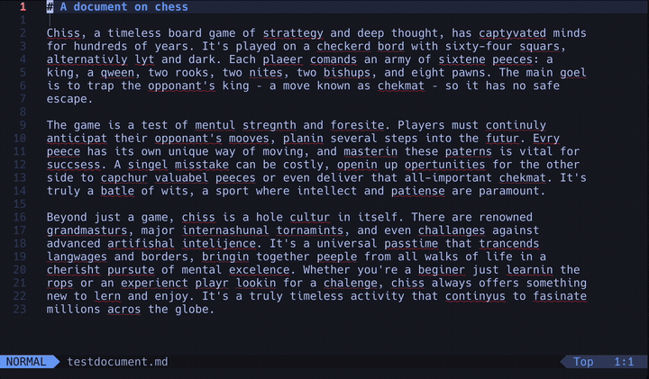

# spellbound.nvim

**Spellbound is mostly vibecoded... Use at your own risk!**

## Demo



## Introduction

`spellbound.nvim` is a Neovim plugin that introduces a new 'pseudo-mode' to
Neovim focused on making spellchecking a breeze.

The idea sprung to mind when I realised a common and helpful keybind was `1z=`
(accept first suggestion), which for me is the right suggestion about about 80%
of the time...

## Installation

Using your package manager (e.g. lazy)

```lua
{
  'samuelstranges/spellbound.nvim',
  config = function()
    require('spellbound').setup()
  end,
}
```

## Functionality

Spellbound is activated with `<leader>S` and returns to normal mode with `Esc`.

### Mode Features

When spellcheck mode is active, you have access to:

- `w`: go to next incorrect word with suggestion preview (`]s`)
- `b`: go to previous incorrect word with suggestion preview (`[s`)
- `a`: auto-fix; accept first suggestion (`1z=`)
- `c`: change current word (`ciw`)
- `d`: add to dictionary (`zg`)
- `i`: ignore spelling (`zG`)
- `u`: undo (`u`)
- `s`: spelling suggestions to choose from (`z=`)
- `t`: toggle suggestion preview on/off
- `Esc`: return to normal mode

### Visual Elements

When the mode is active, a small UI panel appears at the bottom of the screen
showing the available commands for quick reference. A preview of the first
suggestion appears above misspelled words when navigating between them.

## Configuration

```lua
require('spellbound').setup({
    -- UI options
    ui = {
        enable = true,             -- Enable the UI helper window
        suggestion_preview = true, -- Enable suggestion preview
    },

    -- Key mapping options
    mappings = {
        leader = '<leader>S', -- Key to enter spellcheck mode
    }
})
```

## Roadmap

1. Custom Colors?
2. Bug fixes e.g. weird things happening when preceded by a single quote
3. Example video
4. Disable other keybindings while in mode?

### Not planned

- Editing multiple entries at once (gets a bit wonky)

## Credits

colors weren't working until i passed claude code colorize.nvim as a reference
lol... doesn't seem to want to use it though...
